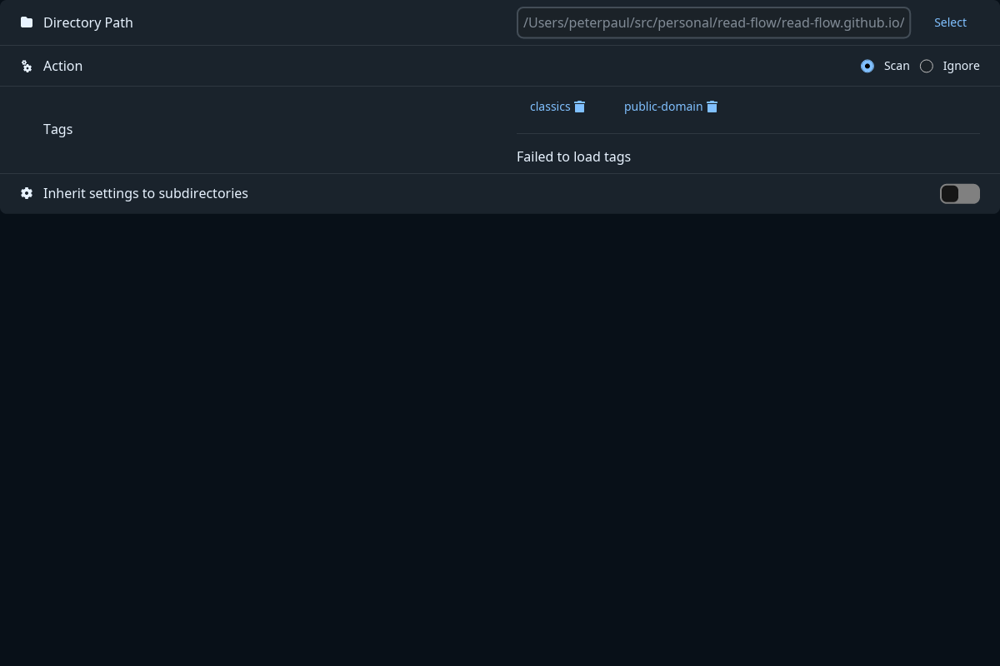

On first run, Read Flow writes a `read-flow.toml` file for you — most people never need to edit
it by hand, since every setting also has a control in the app's **Preferences** UI.

`read-flow.toml` is specific to your machine: it holds your server's hashed credentials and local
file paths, so it's never checked into version control and each installation gets its own copy.

## Configuration sections

| Section            | What it controls                                                  |
| ------------------- | ------------------------------------------------------------------- |
| `[database]`       | Path to the SQLite database file.                                 |
| `[server]`         | Bind address/port, allowed origins, and authorized users.         |
| `[scan]`           | Which folders to scan, file types, concurrency, auto-tag rules.   |
| `[ui]`             | Private mode and which tags count as private.                     |
| `[online_library]` | OPDS catalogs to search (Project Gutenberg, Standard Ebooks, …).  |

## Adding a folder to scan

From the app: **Preferences → Scan → Add folder**. The equivalent config entry looks like:

```toml
[scan.directories."/home/you/Documents"]
action = "Scan"
tags = []
inherit = false
```

- `action` — `"Scan"` to index files found here, or `"Ignore"` to skip a subfolder inside an
  already-scanned tree.
- `tags` — tags automatically applied to everything found in this folder.
- `inherit` — whether subfolders inherit this entry's tags/action by default.



## Running headless

On a home server or NAS, skip the GUI entirely:

```bash
read-flow --headless --address 0.0.0.0 --port 8000
```

See [Headless server + PWA](/guides/advanced/headless-pwa/) for the full walkthrough, and
[Multi-instance &amp; remote sources](/guides/advanced/multi-instance/) if you're connecting more
than one Read Flow server from the same web app.
